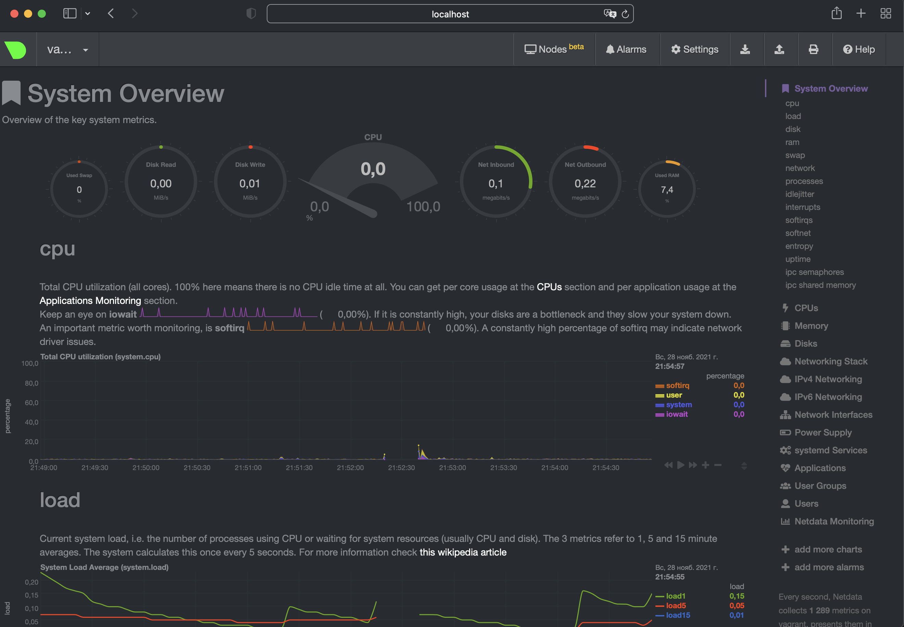

# Домашнее задание к занятию "3.4. Операционные системы, лекция 2"

1. На лекции мы познакомились с [node_exporter](https://github.com/prometheus/node_exporter/releases). В демонстрации его исполняемый файл запускался в background. Этого достаточно для демо, но не для настоящей production-системы, где процессы должны находиться под внешним управлением. Используя знания из лекции по systemd, создайте самостоятельно простой [unit-файл](https://www.freedesktop.org/software/systemd/man/systemd.service.html) для node_exporter:

    * поместите его в автозагрузку,
    * предусмотрите возможность добавления опций к запускаемому процессу через внешний файл (посмотрите, например, на `systemctl cat cron`),
    * удостоверьтесь, что с помощью systemctl процесс корректно стартует, завершается, а после перезагрузки автоматически поднимается.
    
    Последовательность действий для решения:
    * скачиваем архив с Node Exporter - `wget https://github.com/prometheus/node_exporter/releases/download/v1.3.0/node_exporter-1.3.0.linux-amd64.tar.gz`
    * распаковываем `tar xvfz node_exporter-1.3.0.linux-amd64.tar.gz` и переносим в `/usr/sbin/node_exporter-1.3.0`
    * создадим unit файл - `/usr/lib/systemd/system/node_exporter.service` со следующим содержимым - 
    ```
    [Unit]
    Description=prometheus node exporter
    Documentation=test doc for node exporter
    
    [Service]
    EnvironmentFile=/usr/sbin/node_exporter/node_exporter.config
    ExecStart=/usr/sbin/node_exporter/node_exporter $OPTIONS
    Restart=on-failure
    Type=simple
    
    [Install]
    WantedBy=multi-user.target
   ```
    * создадим конфиг файл - `touch /usr/sbin/node_exporter/node_exporter.config` со следующим содержимым:
    ```
    OPTIONS='--collector.tcpstat'
   ```
   * перезагрузим конфигурацию systemd `systemctl daemon-reload`
   * добавим старт сервиса при запуске системы `systemctl enable node_exporter`
   * запустим сервис - `systemctl start node_exporter`
   * проверим командой `curl http://localhost:9100/metrics`, все ок, метрики отображаются
   * с помощью systemctl процесс успешно завершается 
   ```bash
    root@vagrant:/home/vagrant# systemctl stop node_exporter
    root@vagrant:/home/vagrant# systemctl status node_exporter
    ● node_exporter.service - prometheus node exporter
         Loaded: loaded (/etc/systemd/system/node_exporter.service; enabled; vendor preset: enabled)
         Active: inactive (dead) since Sun 2021-11-28 18:31:07 UTC; 3s ago
        Process: 1291 ExecStart=/usr/sbin/node_exporter/node_exporter $OPTIONS (code=killed, signal=TERM)
       Main PID: 1291 (code=killed, signal=TERM)
   ```
   * и также с помощью systemctl успешно стартует
   ```bash
    root@vagrant:/home/vagrant# systemctl start node_exporter
    root@vagrant:/home/vagrant# systemctl status node_exporter
    ● node_exporter.service - prometheus node exporter
         Loaded: loaded (/etc/systemd/system/node_exporter.service; enabled; vendor preset: enabled)
         Active: active (running) since Sun 2021-11-28 18:31:21 UTC; 1s ago
       Main PID: 1339 (node_exporter)
          Tasks: 5 (limit: 2278)
         Memory: 2.4M
         CGroup: /system.slice/node_exporter.service
             └─1339 /usr/sbin/node_exporter/node_exporter --collector.tcpstat
   ```
   * после перезагрузки системы процесс автоматически поднялся
   ```bash
   vagrant@vagrant:~$ systemctl status node_exporter
    ● node_exporter.service - prometheus node exporter
         Loaded: loaded (/etc/systemd/system/node_exporter.service; enabled; vendor preset: enabled)
         Active: active (running) since Sun 2021-11-28 18:36:11 UTC; 26s ago
       Main PID: 641 (node_exporter)
          Tasks: 5 (limit: 2278)
         Memory: 13.6M
         CGroup: /system.slice/node_exporter.service
             └─641 /usr/sbin/node_exporter/node_exporter --collector.tcpstat

    Nov 28 18:36:11 vagrant node_exporter[641]: ts=2021-11-28T18:36:11.402Z caller=node_exporter.go:115 level=info collector=thermal_zone
    Nov 28 18:36:11 vagrant node_exporter[641]: ts=2021-11-28T18:36:11.402Z caller=node_exporter.go:115 level=info collector=time
    Nov 28 18:36:11 vagrant node_exporter[641]: ts=2021-11-28T18:36:11.402Z caller=node_exporter.go:115 level=info collector=timex
    Nov 28 18:36:11 vagrant node_exporter[641]: ts=2021-11-28T18:36:11.402Z caller=node_exporter.go:115 level=info collector=udp_queues
    Nov 28 18:36:11 vagrant node_exporter[641]: ts=2021-11-28T18:36:11.402Z caller=node_exporter.go:115 level=info collector=uname
    Nov 28 18:36:11 vagrant node_exporter[641]: ts=2021-11-28T18:36:11.402Z caller=node_exporter.go:115 level=info collector=vmstat
    Nov 28 18:36:11 vagrant node_exporter[641]: ts=2021-11-28T18:36:11.402Z caller=node_exporter.go:115 level=info collector=xfs
    Nov 28 18:36:11 vagrant node_exporter[641]: ts=2021-11-28T18:36:11.402Z caller=node_exporter.go:115 level=info collector=zfs
    Nov 28 18:36:11 vagrant node_exporter[641]: ts=2021-11-28T18:36:11.402Z caller=node_exporter.go:199 level=info msg="Listening on" address=:9100
    Nov 28 18:36:11 vagrant node_exporter[641]: ts=2021-11-28T18:36:11.403Z caller=tls_config.go:195 level=info msg="TLS is disabled." http2=false
    vagrant@vagrant:~$ uptime
     18:36:44 up 0 min,  1 user,  load average: 0.05, 0.01, 0.00
   ```
1. Ознакомьтесь с опциями node_exporter и выводом `/metrics` по-умолчанию. Приведите несколько опций, которые вы бы выбрали для базового мониторинга хоста по CPU, памяти, диску и сети.
    * --collector.cpu
    * --collector.diskstats
    * --collector.filesystem
    * --collector.meminfo
    * --collector.netstat
1. Установите в свою виртуальную машину [Netdata](https://github.com/netdata/netdata). Воспользуйтесь [готовыми пакетами](https://packagecloud.io/netdata/netdata/install) для установки (`sudo apt install -y netdata`). После успешной установки:
    * в конфигурационном файле `/etc/netdata/netdata.conf` в секции [web] замените значение с localhost на `bind to = 0.0.0.0`,
    * добавьте в Vagrantfile проброс порта Netdata на свой локальный компьютер и сделайте `vagrant reload`:

    ```bash
    config.vm.network "forwarded_port", guest: 19999, host: 19999
    ```

    После успешной перезагрузки в браузере *на своем ПК* (не в виртуальной машине) вы должны суметь зайти на `localhost:19999`. Ознакомьтесь с метриками, которые по умолчанию собираются Netdata и с комментариями, которые даны к этим метрикам.
    * успешно
    
1. Можно ли по выводу `dmesg` понять, осознает ли ОС, что загружена не на настоящем оборудовании, а на системе виртуализации?
    * да, можно, если ОС загружена на системе виртуализации то в выводе будет присутствовать например такая информация - `Hypervisor detected: KVM`
1. Как настроен sysctl `fs.nr_open` на системе по-умолчанию? Узнайте, что означает этот параметр. Какой другой существующий лимит не позволит достичь такого числа (`ulimit --help`)?
    * по умолчанию `fs.nr_open = 1048576`. Этот параметр означает максимальное количество открытых файлов в системе. 
    * Пользовательский лимит не даст достичь такого числа. Значение по умолчанию - 1024
    ```bash
    root@vagrant:/home/vagrant# ulimit -n
    1024 
   ```
1. Запустите любой долгоживущий процесс (не `ls`, который отработает мгновенно, а, например, `sleep 1h`) в отдельном неймспейсе процессов; покажите, что ваш процесс работает под PID 1 через `nsenter`. Для простоты работайте в данном задании под root (`sudo -i`). Под обычным пользователем требуются дополнительные опции (`--map-root-user`) и т.д.
    * перешел в `screen` запустил `unshare -f  --pid --mount-proc /bin/bash`
    ```bash
    root@vagrant:/home/vagrant# unshare -f  --pid --mount-proc /bin/bash
    root@vagrant:/home/vagrant# ps -ef
    UID          PID    PPID  C STIME TTY          TIME CMD
    root           1       0  0 17:05 pts/5    00:00:00 /bin/bash
    root           8       1  0 17:06 pts/5    00:00:00 ps -ef
   ```
   * вышел из screen , смотрим список процессов
   ```bash
    vagrant@vagrant:~$ ps -ef | grep bin/bash
    vagrant    12098   12097  0 16:57 pts/5    00:00:00 /bin/bash
    root       12167   12121  0 17:05 pts/5    00:00:00 unshare -f --pid --mount-proc /bin/bash
    root       12168   12167  0 17:05 pts/5    00:00:00 /bin/bash
    vagrant    12190    1733  0 17:08 pts/3    00:00:00 grep --color=auto bin/bash
   ```
   * наш процесс с pid=12168
   * подключаемся к неймспейсу через nsenter и смотрим список процессов
   ```bash
    vagrant@vagrant:~$ sudo su
    root@vagrant:/home/vagrant# nsenter --target 12168 --pid --mount
    root@vagrant:/# ps aux
    USER         PID %CPU %MEM    VSZ   RSS TTY      STAT START   TIME COMMAND
    root           1  0.0  0.1   9836  4048 pts/5    S+   17:05   0:00 /bin/bash
    root           9  0.0  0.2   9836  4220 pts/3    S    17:09   0:00 -bash
    root          18  0.0  0.1  11492  3244 pts/3    R+   17:09   0:00 ps aux
    root@vagrant:/#
   ```
1. Найдите информацию о том, что такое `:(){ :|:& };:`. Запустите эту команду в своей виртуальной машине Vagrant с Ubuntu 20.04 (**это важно, поведение в других ОС не проверялось**). Некоторое время все будет "плохо", после чего (минуты) – ОС должна стабилизироваться. Вызов `dmesg` расскажет, какой механизм помог автоматической стабилизации. Как настроен этот механизм по-умолчанию, и как изменить число процессов, которое можно создать в сессии?
    * `:(){ :|:& };:` это команда которая создает функцию, которая вызывает сама себя дважды и отправляет в фон, т.е. создает кучу процессов
    * чтобы ограничить число процессов, которое можно создать в текущей сессии можно ввести команду `ulimit -u 200`
    * по умолчанию выставлено ограничение для пользователя `max user processes (-u) 7595`
 