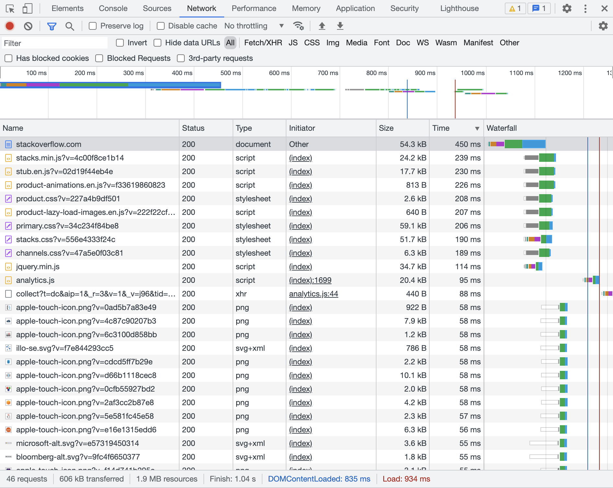
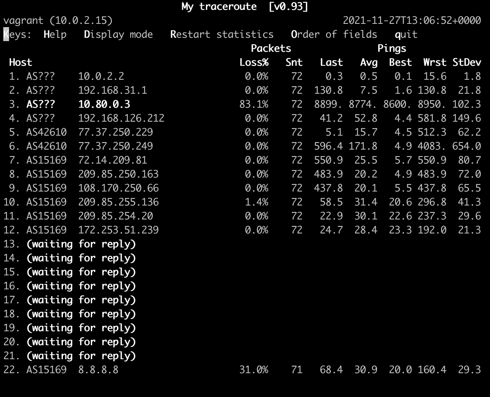

# Домашнее задание к занятию "3.6. Компьютерные сети, лекция 1"

1. Работа c HTTP через телнет.
- Подключитесь утилитой телнет к сайту stackoverflow.com
`telnet stackoverflow.com 80`
- отправьте HTTP запрос
```bash
GET /questions HTTP/1.0
HOST: stackoverflow.com
[press enter]
[press enter]
```

```bash
vagrant@vagrant:~$ telnet stackoverflow.com 80
Trying 151.101.129.69...
Connected to stackoverflow.com.
Escape character is '^]'.
GET /questions HTTP/1.0
HOST: stackoverflow.com

HTTP/1.1 301 Moved Permanently
cache-control: no-cache, no-store, must-revalidate
location: https://stackoverflow.com/questions
x-request-guid: 1732a1fe-c821-4fc2-8d61-ede1eaf43e91
feature-policy: microphone 'none'; speaker 'none'
content-security-policy: upgrade-insecure-requests; frame-ancestors 'self' https://stackexchange.com
Accept-Ranges: bytes
Date: Fri, 26 Nov 2021 18:05:16 GMT
Via: 1.1 varnish
Connection: close
X-Served-By: cache-fra19139-FRA
X-Cache: MISS
X-Cache-Hits: 0
X-Timer: S1637949917.605496,VS0,VE92
Vary: Fastly-SSL
X-DNS-Prefetch-Control: off
Set-Cookie: prov=0c7880d8-0732-6305-856f-2f746e2897b1; domain=.stackoverflow.com; expires=Fri, 01-Jan-2055 00:00:00 GMT; path=/; HttpOnly

Connection closed by foreign host.
vagrant@vagrant:~$  
```
- В ответе укажите полученный HTTP код, что он означает?
    * `301 Moved Permanently` - этот код означает, что страница, которую мы запросили, перемещена по новому адресу и старый адрес следует считать устаревшим
2. Повторите задание 1 в браузере, используя консоль разработчика F12.
- откройте вкладку `Network`
- отправьте запрос http://stackoverflow.com
- найдите первый ответ HTTP сервера, откройте вкладку `Headers`
- укажите в ответе полученный HTTP код.
- проверьте время загрузки страницы, какой запрос обрабатывался дольше всего?
- приложите скриншот консоли браузера в ответ.
    * полученный HTTP код - `200`
    * дольше всего обрабатывался зарпрос по адресу https://stackoverflow.com/ - 450ms
    *  скриншот консоли браузера:
    
3. Какой IP адрес у вас в интернете?
    * `46.242.14.126`
4. Какому провайдеру принадлежит ваш IP адрес? Какой автономной системе AS? Воспользуйтесь утилитой `whois`
    * провайдер PJSC Rostelecom
    * AS42610
5. Через какие сети проходит пакет, отправленный с вашего компьютера на адрес 8.8.8.8? Через какие AS? Воспользуйтесь утилитой `traceroute`
    ```bash
        vagrant@vagrant:~$ traceroute -An 8.8.8.8
        traceroute to 8.8.8.8 (8.8.8.8), 30 hops max, 60 byte packets
         1  10.0.2.2 [*]  0.825 ms  0.795 ms  0.748 ms
         2  192.168.31.1 [*]  12.160 ms  11.435 ms  11.417 ms
         3  * * *
         4  192.168.126.212 [*]  13.153 ms  13.466 ms  14.068 ms
         5  77.37.250.229 [AS42610]  13.499 ms  14.041 ms  14.031 ms
         6  77.37.250.249 [AS42610]  14.074 ms  5.168 ms  5.849 ms
         7  72.14.209.81 [AS15169]  8.327 ms  6.169 ms  6.333 ms
         8  * * *
         9  172.253.69.174 [AS15169]  6.332 ms 108.170.250.129 [AS15169]  8.508 ms 108.170.225.36 [AS15169]  6.883 ms
        10  108.170.250.99 [AS15169]  8.480 ms 108.170.250.34 [AS15169]  7.729 ms 108.170.250.130 [AS15169]  7.949 ms
        11  142.251.71.194 [AS15169]  20.376 ms 172.253.66.116 [AS15169]  26.279 ms  25.035 ms
        12  216.239.43.20 [AS15169]  21.831 ms 209.85.254.6 [AS15169]  25.367 ms 108.170.235.204 [AS15169]  21.559 ms
        13  172.253.64.113 [AS15169]  22.342 ms 142.250.56.15 [AS15169]  21.714 ms 172.253.64.51 [AS15169]  22.825 ms
        14  * * *
        15  * * *
        16  * * *
        17  * * *
        18  * * *
        19  * * *
        20  * * *
        21  * * *
        22  * * *
        23  * 8.8.8.8 [AS15169]  21.098 ms  23.298 ms
    ```
    * пакет проходит через следующие AS:
        * AS42610
        * AS15169
6. Повторите задание 5 в утилите `mtr`. На каком участке наибольшая задержка - delay?
    * 
    * Наибольшая задержка на хосте `10.80.0.3`
7. Какие DNS сервера отвечают за доменное имя dns.google? Какие A записи? воспользуйтесь утилитой `dig`
    *  A записи - сервера с IP `8.8.4.4` и `8.8.8.8`
    *  AAAA записи - `2001:4860:4860::8888` и `2001:4860:4860::8844`
    
8. Проверьте PTR записи для IP адресов из задания 7. Какое доменное имя привязано к IP? воспользуйтесь утилитой `dig`
    * привязано доменное имя `dns.google.`
    ```bash
    vagrant@vagrant:~$ dig -x 8.8.8.8
    
    ; <<>> DiG 9.16.1-Ubuntu <<>> -x 8.8.8.8
    ;; global options: +cmd
    ;; Got answer:
    ;; ->>HEADER<<- opcode: QUERY, status: NOERROR, id: 52396
    ;; flags: qr rd ra; QUERY: 1, ANSWER: 1, AUTHORITY: 0, ADDITIONAL: 1
    
    ;; OPT PSEUDOSECTION:
    ; EDNS: version: 0, flags:; udp: 65494
    ;; QUESTION SECTION:
    ;8.8.8.8.in-addr.arpa.		IN	PTR
    
    ;; ANSWER SECTION:
    8.8.8.8.in-addr.arpa.	30	IN	PTR	dns.google.
    
    ;; Query time: 20 msec
    ;; SERVER: 127.0.0.53#53(127.0.0.53)
    ;; WHEN: Sat Nov 27 14:12:01 UTC 2021
    ;; MSG SIZE  rcvd: 73
    ```
   
   ```bash
   vagrant@vagrant:~$ dig -x 8.8.4.4

    ; <<>> DiG 9.16.1-Ubuntu <<>> -x 8.8.4.4
    ;; global options: +cmd
    ;; Got answer:
    ;; ->>HEADER<<- opcode: QUERY, status: NOERROR, id: 4939
    ;; flags: qr rd ra; QUERY: 1, ANSWER: 1, AUTHORITY: 0, ADDITIONAL: 1
    
    ;; OPT PSEUDOSECTION:
    ; EDNS: version: 0, flags:; udp: 65494
    ;; QUESTION SECTION:
    ;4.4.8.8.in-addr.arpa.		IN	PTR
    
    ;; ANSWER SECTION:
    4.4.8.8.in-addr.arpa.	30	IN	PTR	dns.google.
    
    ;; Query time: 16 msec
    ;; SERVER: 127.0.0.53#53(127.0.0.53)
    ;; WHEN: Sat Nov 27 14:15:33 UTC 2021
    ;; MSG SIZE  rcvd: 73
   ```

---